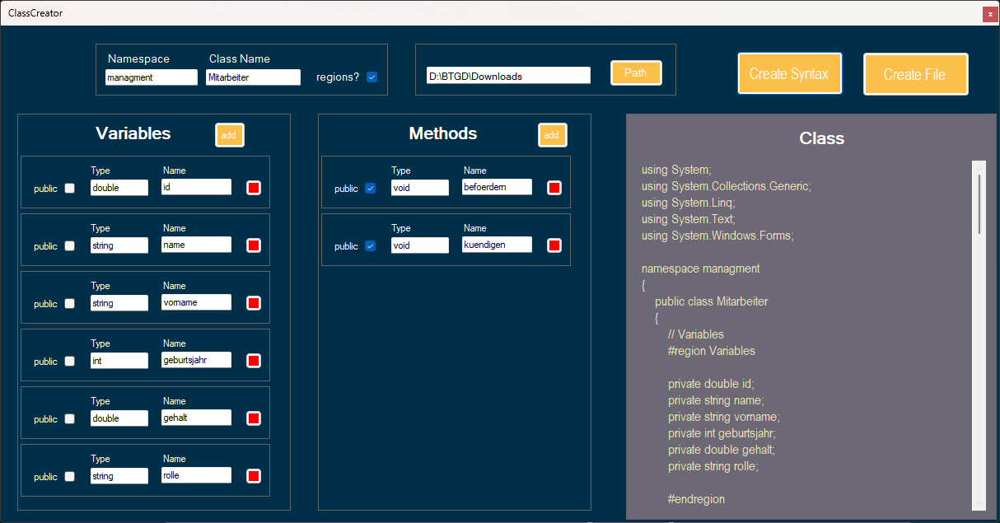

<h1 align="center" id="title">ClassCreator</h1>

Ein simpler Klassengenerator der einem bei Angaben von Variablen und Klassen den vollständigen Klassen-Syntax erstellt. Dazu gibt es die Möglichkeit direkt eine Datei für die Klasse zu erstellen. Dieses Projekt wurde als Hilfestellung für Programmieranfänger in neueren Klassen auf meiner Schule entwickelt

<h2>Project Screenshots:</h2>

  
<h2>Features</h2>

*   Klassen-Syntax-Generator
*   Datei-Generator
